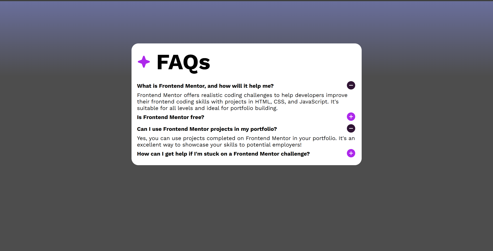

## Table of contents

- [Overview](#overview)
  - [The challenge](#the-challenge)
  - [Screenshot](#screenshot)
- [Author](#author)

## Overview

### The challenge

Users should be able to:

- Hide/Show the answer to a question when the question is clicked
- View the optimal layout for the interface depending on their device's screen size
- See hover and focus states for all interactive elements on the page

### Screenshot

### Built with

- Semantic HTML5 markup
- CSS custom properties
- Flexbox
- TypeScript JSX (just for more prectice)
- [React](https://reactjs.org/) - JS library
- [Vite.js](https://vite.dev/) - React framework

## Author

- Frontend Mentor - [@Dizey5K](https://www.frontendmentor.io/profile/Dizey5K)
- Telegram - [@Dizey_5K](https://t.me/Dizey_5K)